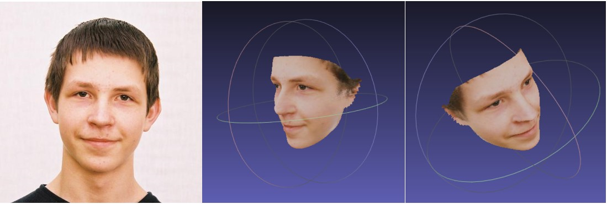

# Joint 3D Face Reconstruction and Dense Alignment with Position Map Regression Network

<p align="center"> 

</p>


This is an official python implementation of PRN.  The training code will be released(about two months later).

PRN is a method to jointly regress dense alignment and 3D face shape in an end-to-end manner. More examples on Multi-PIE and 300VW can be seen in [YouTube](https://youtu.be/tXTgLSyIha8) .

The main features are:

* **End-to-End**  our method can directly regress the 3D facial structure and dense alignment from a single image bypassing 3DMM fitting.

* **Multi-task**  By regressing position map, the 3D geometry along with semantic meaning can be obtained. Thus, we can effortlessly complete the tasks of dense alignment, monocular 3D face reconstruction, pose estimation, etc.

* **Faster than real-time**  The method can run at over 100fps(with GTX 1080) to regress a position map.

* **Robust** Tested on facial images in unconstrained conditions.  Our method is robust to poses, illuminations and occlusions. 

  ​

## Applications

### Basics(Evaluated in paper)

* #### Face Alignment

Dense alignment of both visible and non-visible points(including 68 key points). 


* #### 3D Face Reconstruction

Get the 3D vertices and corresponding colours from a single image.  Save the result as mesh data(.obj), which can be opened with [Meshlab](http://www.meshlab.net/) or Microsoft [3D Builder](https://developer.microsoft.com/en-us/windows/hardware/3d-print/3d-builder-resources). Notice that, the texture of non-visible area is distorted due to self-occlusion.




### More(To be added)

* #### 3D Pose Estimation

  Rather than only use 68 key points to calculate the camera matrix(easily effected by expression and poses), we use all vertices(more than 40K) to calculate a more accurate pose.

  #### 

* #### Texture Fusion


## Getting Started

### Prerequisite

* Python 2.7 (numpy, skimage, scipy)

* TensorFlow >= 1.4

  Optional:

* dlib (for detecting face.  You do not have to install if you can provide bounding box information. )

* opencv2 (for showing results)

GPU is highly recommended. The run time is ~0.01s with GPU(GeForce GTX 1080) and ~0.2s with CPU(Intel(R) Xeon(R) CPU E5-2640 v4 @ 2.40GHz).

### Usage

1. Clone the repository

```bash
git clone https://github.com/YadiraF/PRNet
cd PRNet
```

2. Download the PRN trained model at [BaiduDrive](https://pan.baidu.com/s/10vuV7m00OHLcsihaC-Adsw) or [GoogleDrive](https://drive.google.com/file/d/1UoE-XuW1SDLUjZmJPkIZ1MLxvQFgmTFH/view?usp=sharing), and put it into `Data/net-data`

3. Run the test code.(test AFLW2000 images)

   `python run_basics.py #Can run only with python and tensorflow`

4. Run with your own images

   `python demo.py -i <inputDir> -o <outputDir> --isDlib True  `

   run `python demo.py --help` for more details.


## Contacts

Please contact <a href="fengyao@sjtu.edu.cn">Yao Feng</a> or open an issue for any questions or suggestions(like, push me to add more applications).

Thanks! (●'◡'●)


## Acknowledgements

- Thanks [BFM team](https://faces.dmi.unibas.ch/bfm/), [Xiangyu Zhu](http://www.cbsr.ia.ac.cn/users/xiangyuzhu/projects/3DDFA/main.htm), and [Anil Bas](https://github.com/anilbas/3DMMasSTN) for sharing 3D data.
- Thanks Patrik Huber for sharing his work  [eos](https://github.com/patrikhuber/eos), which helps me a lot in studying 3D Face Reconstruction.
- Thanks the authors of  [3DMMasSTN](https://github.com/anilbas/3DMMasSTN), [DenseReg](https://github.com/ralpguler/DenseReg), [3dmm_cnn](https://github.com/anhttran/3dmm_cnn), [vrn](https://github.com/AaronJackson/vrn), [pix2vertex](https://github.com/matansel/pix2vertex), [face-alignment](https://github.com/1adrianb/face-alignment) for making their excellent works publicly available. 
